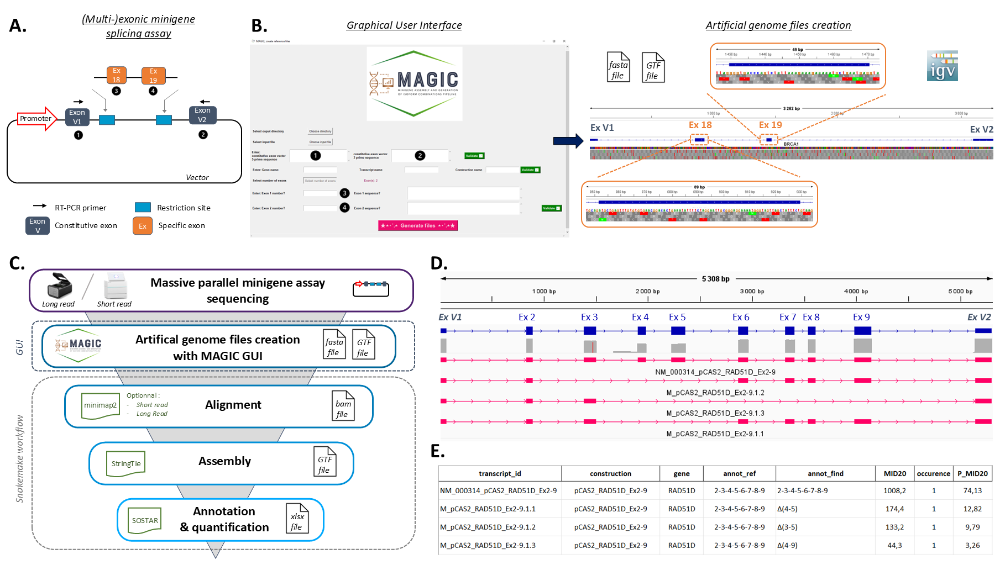
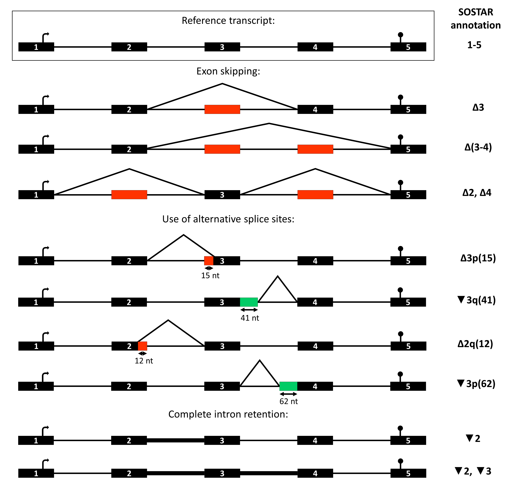

# **MAGIC** - *Minigene Assembly and Generation of Isoform Combinations Pipeline*


A comprehensive toolkit to unravel RNA isoform structures obtained from minigene splicing assay and massive parallel sequencing, integrating both an intuitive GUI and a powerful Snakemake pipeline.



## Table of Contents

- [Overview](#overview)
- [Features](#features)
- [Installation](#installation)
  - [GUI Component](#gui-component)
  - [Pipeline Component](#pipeline-component)
- [Usage](#usage)
  - [Using the GUI](#using-the-gui)
  - [Running the Snakemake Pipeline](#running-the-snakemake-pipeline)
- [SOSTAR annotation](#SOSTAR-annotation)
  - [Output file](#Output-file)
  - [Nomenclature](#Nomenclature)
- [Author](#author)
- [License](#license)

---

## Overview

This tool is composed of two main components:

1. **Graphical User Interface (GUI):** A user-friendly application to generate the reference files required for the pipeline of the artificial genome representing the (multi-)exonic minigene splicing construction in fasta and gtf formats.
2. **Snakemake Pipeline:** A robust and scalable workflow designed for high-throughput environments.

These components can be used independently or together, depending on the user's needs.

---

## Features

- Easy-to-use GUI for configuration file creation
- Modular and reproducible Snakemake pipeline
- Cross-platform compatibility
- Support for containerized execution using [Docker]

---

## Installation

### GUI Component

The GUI application for Windows is available as a standalone executable.

📦 **[Download the latest release here](../../releases)**

To install:
1. Download the `.exe` file from the [Releases](../../releases) section.
2. Run the executable directly (no installation required).


### Pipeline Component

This pipeline is adapted from the [SOSTAR](https://github.com/LBGC-CFB/SOSTAR) pipeline.
First, sequencing files were aligned using the [minimap2](https://lh3.github.io/minimap2/minimap2.html) RNAseq aligner in either short or long read mode depending on the option used.
Then, isoform combinations were assembled using the [StringTie](http://ccb.jhu.edu/software/stringtie/index.shtml?t=manual) tool in a guided mode with the `construction.gtf` created by the GUI. They are merged using the merged mode of StringTie et expressions were computed with the expression mode of StringTie. Finally, isoforms were annotated using the [SOSTAR nomenclature](#installation) related to the construction used. 

The Snakemake pipeline requires a Unix-like environment (Linux, macOS).

_Requirements:_
- Python >= 3.8
- Snakemake >= 7.32.4 or greater
- Apptainer/Singularity >= 3.5.3 or greater

*The workflow automatically uses a [docker image](https://hub.docker.com/r/aucam/magic) which contains the other tools required.*

> To set up:
```bash
git clone https://github.com/LBGC-CFB/MAGIC.git
cd ./MAGIC
```

> To configure this workflow, modify the `./config/config.yaml` file according to your needs.

- `constructiondir`: Path of the construction directories that contains the different constructions with their corresponding `construction.fasta` and `construction.gtf`.

- `indir`: Path of the directory containing either the `*.fastq` file for long read sequencing or the `*_L001_R1_001.fastq.gz` and `*_L001_R2_001.fastq.gz` files for short read sequencing.

- `outdir`: Path of the outdirectory.

- `samples`: names of the differents samples: name of the construction used

- `threads`: number of threads to use.

- `option`: shortread or longread, indicated by true or false.


## Usage

### Using the GUI

1. Launch the GUI application.

2. Define the necessary parameters.

3. Click on Generate files. *The files will be generated once all the necessary parameters have been defined.*

4. Transfer the file to the machine where the pipeline will be executed.


### Running the Snakemake pipeline

Given that the workflow has been properly configured, it can be executed as follows:
```bash
cd ./workflow
snakemake --use-singularity --cores
```  
You can provide your own configuration file using the `--configfile` option when launching the pipeline — as long as it follows the same structure and format.

⚠️ Warning:
If you encounter **write access errors** with Apptainer/Singularity, ensure your working directories are correctly bound by exporting the proper `APPTAINER_BINDPATH` or `SINGULARITY_BINDPATH` as follow:

```bash
export APPTAINER_BINDPATH="/path/to/data/dir"
```

Output directory tree:
```
MAGIC/outdir
├── alignment
│   ├── {sample}.minimap2.bam
│   ├── {sample}.minimap2.bam.bai
│   └── ...
├── assembly
│   └── {construction}
│       ├── {sample}_assembly.gtf
│       ├── ...
│       └── {construction}_merged.gtf
│   └── ...
├── expression
│   ├── {sample}_expression.gtf
│   └── ...
├── constructions_all.gtf
└── MAGIC_SOSTAR_annotation_table_results.xlsx
```

- `alignment` folder: contains all aligned and sorted {sample} <.bam> with their corresponding index <.bai>.
- `assembly` folder: contains subfolders of all assembled <.gtf> {sample} with StringTie and the corresponding merge <.gtf> file for each different construction.
- `expression` folder: contains all assembled <.gtf> with expression metrics computed by StringTie.
- `constructions_all.gtf`: a global gtf file of all the different file of constructions used for the merge step.
- `MAGIC_SOSTAR_annotation_table_results.xlsx`: final output file containing descriptive annotation and expression metrics of each transcript in the cohort (see [SOSTAR annotation](##SOSTAR-annotation) section for more informations).


## SOSTAR annotation

MAGIC uses the SOSTAR tool to provide annotation of all the different isoforms assembled by StringTie. 

### Output file

SOSTAR generates a spreadsheet file in <.xlsx> format:

| transcript_id	| construction | gene | annot_ref | annot_find | MIN01 | MIN02 | MIN03 | occurence | P_MIN01 | P_MIN02 | P_MIN03 |
| ------------- | ---- | :---: | :--: | :-------: | :-----------: | :-------: | :-------: | :-------: | :-------: | :-------: | :-------: |
NM_000059_pCAS2_BRCA2_Ex3 | pCAS2_BRCA2_Ex3 | *BRCA2* | 3 | 3 | 76093,1 | 1114,3 | 15320,6 | 3 | 98,76 | 0,6 | 10,53 
M_pCAS2_BRCA2_Ex3.1.1 | pCAS2_BRCA2_Ex3 | *BRCA2* | 3 | Δ3 | 954 | 184159,5 | 130188,3 | 3 | 1,24 | 99,4 | 89,47
  |  |  |  |  |  |  |  |  |  |   |

- *`transcript_id`* : transcript identifier
- *`construction`* : construction name
- *`gene`* : gene associated to the transcript
- *`annot_ref`* : reference annotation of construction
- *`annot_find`* : SOSTAR annotation of transcript (see section [SOSTAR nomenclature](##Nomenclature) for more details).
- *`sample`* : transcript coverage
- *`occurence`* : number of transcript occurrences in cohort
- *`P_sample`* : transcript coverage proportion between all isoform combinations


### Nomenclature
Isoforms are described relative to reference transcripts (provided by user) by an annotation 
including **only the alternative splicing events**.
Some conventions were established to annotate the alternative splicing events:

| symbol	| definition	|
| :-:	| ---	|
| ∆	| skipping of a reference exon	|
| ▼	| inclusion of a reference intron	|
| p	| shift of an acceptor site	|
| q	| shift of a donnor site	|
| (37)	| number of skipped or retained nucleotides	|
| [p23, q59]	| relative positions of new splice sites	|
| exo	| exonization of an intronic sequence	|
| int	| intronization of an exonic sequence	|
| -	| continuous event	|
| ,	| discontinuous event	|

Nomenclature example:

*Black boxes: exon, black lines: intron, red boxes: exon (or part of exon) skipping, green boxes: novel exon (or part of exon).*

## Author

Camille AUCOUTURIER @AUCAM

## License

This project is under GPL-3.0 License, see [LICENCE](https://github.com/LBGC-CFB/MAGIC/blob/main/LICENSE) for more details.